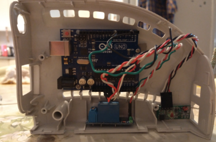
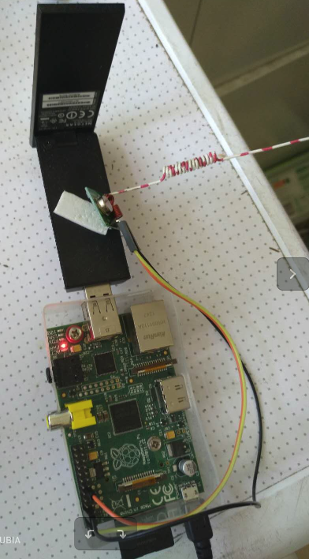

# REST api
This is a simple Flask based RestApi for driving the arduino remotely.
## Getting Started

The project is ready to run as is. You will need Python 3.4 or later.

### Create a Virtual Environment

After cloning or downloading the repo, create a Python virtual environment with:

```
cd restapi
python -m venv .virtualenv
```
### Activate the Virtual Environment

Now activate the virtual environment. on macOS, Linux and Unix systems, use:

```
source .virtualenv/bin/activate
```

On Windows:

```
.virtualenv\Scripts\activate.bat
```

### Install the Development Environment

Now run:

```
pip install -e .[dev]
```

This will install the packages the project depends on in production as well as packages needed during development.


# autosprinkler
Auto water sprinkler project for my back yard

## Prerequisites
- Raspberry pi
- Arduino
- Hose pipes
- T-pipe(optional)
- Solenoid valve(normally open)
- Raspberry pi 433mhz transmitter
- Arduino 433mhz reciever
- Connector pipes
- Tap valve
- Hose connector
- Relay

## To build
### Software
Download sprinklercontroller.ino and ???.py and upload respectively to Arduino and Raspberry pi. After installing these you should be ready to go.

### Hardware
Install the Solenoid valve and T-pipe to water source (T-pipe only required if you still want to use original tap). Then connect hose adapter and hose pipe before creating a sprinkler system around the needed parts of the garden. Connect switch to Solenoid valve and power supply.
Now the sprinkler system should be working, test by switching the switch on.

If you only require the sprinkler system without pi automation you can stop here.

### Pi automation
#### wiring 433mhz transmitter to Raspberry Pi
1. Connect ATAD pin on 433mhz transmitter to 5V GPIO
2. Connect VCC pin on 433mhz transmitter to  GPIO pin 17
3. Connect GND pin on 433mhz transmitter to GND GPIO
#### wiring 433mhz reciever to Arduino
1. Connect 5V pin on 433mhz reciever to 5V GPIO
2. Connect OUT pin on 433mhz reciever to GPIO 7
3. Connect GND pin on 433mhz reciever to GND GPIO
#### setting up Raspberry pi and Arduino
Upload sprinklercontroller.ino to Arduino. Upload ???.py to Raspberry Pi and run to turn on sprinkler system, run ???.py again to turn off sprinkler system. 
#### Photos
##### Arduino
<br />
finished picture of arduino(White casing optional)
##### Raspberry Pi



finished picture of Raspberry Pi
